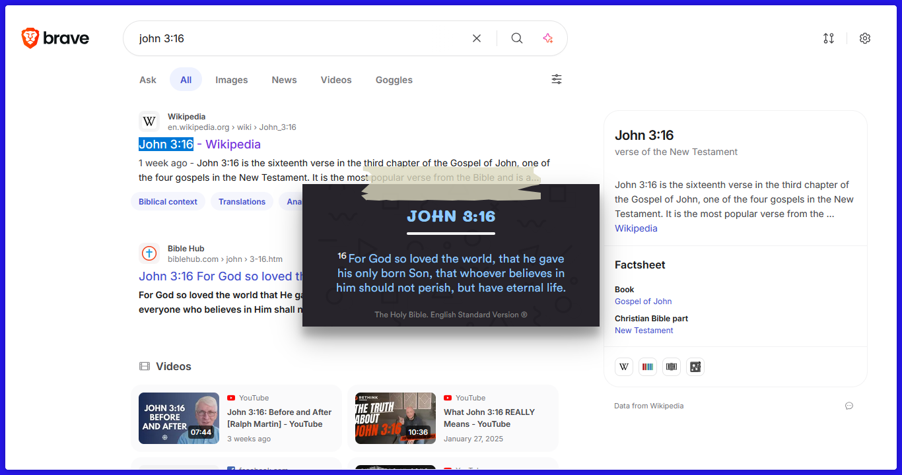
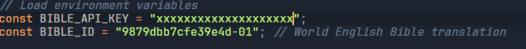
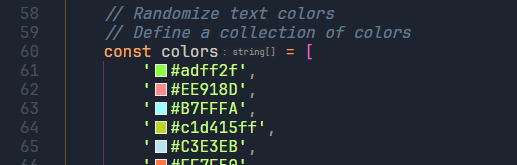

# A simple bible verse preview extension using CTRL+ALT+selection.

  


Features include: 
* Quickly preview a verse without having to link it to an API or switching tabs. 
* Detect multiple wording of the same verse e.g 2 Corinthians 1:1, 2nd Corinthians 1:1, 2 Cor 1:1.
* Title animation and multiple colors for the UI nerds.

## Steps to build
1. Pull the repository and install packages.
  ```sh
  git pull https://github.com/bushieman/Bible-Verse-Extension.git
  pnpm i
  ```

2. In the `src/components/BibleVerse.jsx`, replace the api key with your specific key from https://scripture.api.bible/ and change the bible id from https://docs.api.bible/guides/bibles to your preferred translation. 
  

3. Finally run the following commands.
    ```sh
    // chrome
    npm run build
    npm run zip

    //firefox
    npm run build:firefox
    npm run zip:firefox
    ```

4. Now all you need to do is extract the generated zip file in /dist and load unpacked the extracted folder in chromium browsers. For mozilla browsers, you will need to modify the `manifest.json` from the extracted folder by adding the following lines of code:
    ```sh
      "permissions": ["https://api.scripture.api.bible/*"],
      "browser_specific_settings": { "gecko": { "id": "blahblah@blah" }},
    ``` 
    This will enable the firefox engine to grant the local extension access to the rest API. Once done, zip the contents of this folder **inside the folder** and name the zip file ending with an **.xpi**.

   
5. For tweaks, run `npm run dev` and make changes then repeat steps 3 and 4.
   *NB*: Tweak the text colors to your liking by placing the HEX codes on colors list in src/components/Home.jsx
   

ATTRIBUTION:
<a href='https://dryicons.com/icon/bible-icon-11419'> Extension Icon by Dryicons </a>
